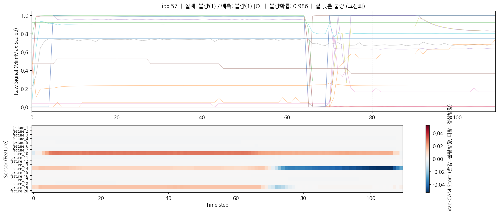
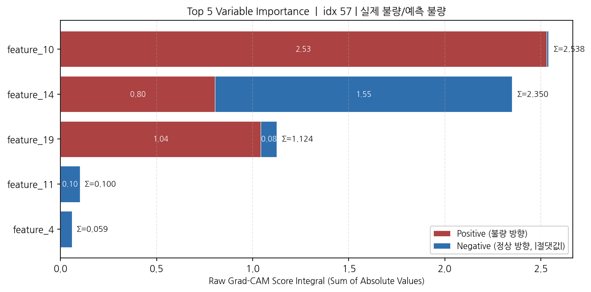
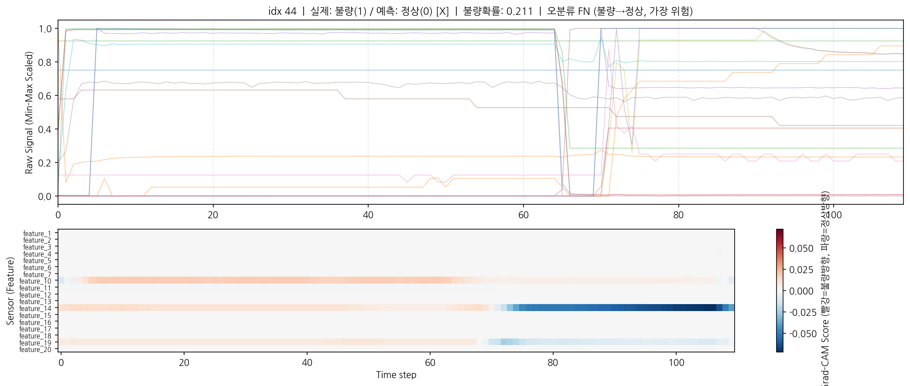

# STAM-MTS: Sensor-Time Activation Mapping for Multivariate Time Series

제조 공정의 다변량 센서 시계열 데이터에서 **불량의 원인을 "어느 센서, 어느 시점"** 단위로 정량적으로 규명하는 설명가능 AI(Explainable AI) 모델입니다.

높은 분류 정확도를 유지하면서, Grad-CAM 기반 해석을 통해 불량 판정의 근거를 현장에서 활용 가능한 형태로 제공하는 것을 목표로 합니다.

> 반도체 제조 공정 센서 데이터(STMicroelectronics 공개 데이터셋 기반)를 사용해 모델의 실효성을 검증했습니다.

---

## 핵심 요약

- **문제**: 일반 1D-CNN + Grad-CAM은 합성곱 연산에서 센서 정보가 혼합되어, 불량에 기여한 개별 센서를 정확히 추적하기 어렵다.
- **접근**: 센서별 독립 브랜치(브랜치 동형화) + Dilated 1D Conv + Adaptive Pooling으로 설계해, **센서 간 공정한 비교가 가능한 Grad-CAM Score**를 산출한다.
- **결과**: Test 기준 **Accuracy 0.983 / F1 0.973 / Recall 0.986** 달성. 더불어 불량 판정의 원인 센서·시점을 시각적으로 규명하고, 오분류 사례까지 메커니즘 수준으로 분석했다.

---

## 모델 구조

PPT 설계 사양에 따라 네 단계로 구성됩니다.

| 단계 | 구성 | 목적 |
|------|------|------|
| Preprocessing | 센서별 Min-Max Scaling | 센서 간 스케일 차이 제거 → 공정한 Grad-CAM 비교 |
| Feature Extraction | Dilated 1D Conv + Leaky ReLU | 드리프트/노이즈 환경에 강인, Dying ReLU 방지 |
| Feature Aggregation | Adaptive Avg Pooling 1D + FC | 가변 길이 시계열을 고정 길이로 통일 |
| Interpretability | 마지막 Conv Layer에 Grad-CAM hook | 센서×시점 단위 중요도 산출 |

### 설계 핵심: 브랜치 동형화

모든 센서가 **동일한 구조의 독립 브랜치**(같은 커널, dilation, activation, pooling)를 통과합니다. 이를 통해 모델/학습 조건의 차이로 인한 편차를 통제하여, 센서 간 Grad-CAM Score를 직접 비교할 수 있게 만든 것이 핵심 기여입니다.

```
입력 (K, T)  →  센서별 독립 브랜치 K개 (동형)  →  Adaptive Pooling  →  Concat  →  FC  →  분류
                         ↑
                  Grad-CAM hook (마지막 Conv)
```

---

## 데이터

| 항목 | 값 |
|------|-----|
| 샘플 수 (제품) | 1,155개 |
| 센서(피처) 수 | 18개 |
| 시계열 길이 | 98~112 (가변) |
| 클래스 | 정상 / 불량 (불량 비율 약 32%) |

- 각 제품(MaterialID)은 Step1·Step2 두 공정 단계를 시간축으로 이어붙여 하나의 시계열로 구성됩니다.
- 노이즈가 심한 센서 2개(feature_8, 9)는 전처리 단계에서 제외했습니다.
- 클래스 불균형은 학습 시 class weight로 보정했습니다.

> **데이터 다운로드**: 본 저장소에는 라이선스 정책에 따라 데이터를 포함하지 않습니다.
> [STMicroelectronics/ST-AWFD](https://github.com/STMicroelectronics/ST-AWFD)에서 Wafer D2 데이터셋을 받아 `data/D2_data.csv`로 배치하세요.

---

## 성능

Test set(231개 제품) 기준, 재현 가능한 결과(seed=42)입니다.

| 지표 | 값 |
|------|-----|
| Accuracy | 0.9827 |
| F1-Score | 0.9730 |
| Precision | 0.9600 |
| **Recall** | **0.9863** |

> **Recall이 Precision보다 높습니다.** 불량을 거의 놓치지 않는다는 의미로, 불량 유출 비용이 큰 제조 품질관리 관점에서 바람직한 특성입니다.

---

## 해석 결과 (Explainability)

이 프로젝트의 핵심은 정확도가 아니라 **"모델이 왜 그렇게 판단했는가"를 규명**하는 데 있습니다. Test set에서 모델의 다양한 면을 보여주는 대표 샘플 5개를 자동 선정해 분석했습니다.

분석은 모두 **불량 관점(target_class=1)** 으로 고정했습니다. "이 제품이 불량이라면 어느 센서·어느 시점이 근거인가"를 보기 위함이며, 이는 모델의 실제 예측과는 독립적인 해석 축입니다.

### 1. 잘 맞춘 불량 — feature_10이 핵심 증거





올바르게 불량으로 분류된 샘플에서는 **feature_10의 양의 기여(불량 방향)가 시계열 전 구간에 걸쳐 일관되게 강하게** 나타납니다. 두 개의 독립적인 불량 샘플(idx 57, 135)에서 Top 센서 순위와 비율이 거의 동일해, 모델이 우연이 아니라 불량의 패턴을 일관되게 학습했음을 보여줍니다.

### 2. feature_14의 단계별 양면성

가장 흥미로운 발견입니다. feature_14는 **Step1 구간에서는 불량 방향(양), Step2 구간에서는 정상 방향(음)** 으로 부호가 뒤집힙니다. 즉 공정 단계에 따라 역할이 달라지는, 이 모델의 **가장 결정적인 판별 센서**입니다.

### 3. 오분류 메커니즘 분석

정확도만 보고하는 대신, 모델이 **어디서 왜 실패하는지**까지 분석했습니다.



가장 위험한 오류인 **FN(불량을 정상으로 놓친 사례, idx 44)** 에서는, feature_14의 Step2 구간 음의 신호(정상 방향)가 비정상적으로 강해 모델이 정상으로 오판했습니다. feature_10의 불량 신호가 약했던 것이 원인입니다.

> **실무 시사점**: feature_14의 Step2 구간만 신뢰해서는 안 되며, feature_10의 Step1 거동을 반드시 함께 확인해야 불량 유출(FN)을 줄일 수 있습니다.

---

## 프로젝트 구조

```
STAM-MTS/
├── src/
│   ├── dataset.py     # 데이터 로딩, Min-Max Scaling, stratified split
│   ├── model.py       # MC-DCNN (센서별 브랜치 + Adaptive Pooling + FC)
│   ├── train.py       # 학습 루프, 검증, 체크포인트 저장, seed 고정
│   └── gradcam.py     # Grad-CAM hook, 중요도 산출, 큐레이션 시각화
├── data/
│   └── D2_data.csv
├── outputs/
│   └── gradcam/       # 히트맵 & 중요도 차트
├── checkpoints/
│   └── stam_mts_best.pt
├── requirements.txt
└── README.md
```

---

## 사용법

```bash
# 1. 환경 설정
pip install -r requirements.txt

# 2. 데이터 배치
#    data/D2_data.csv 위치에 데이터를 둡니다.

# 3. 학습 (best 모델이 checkpoints/에 저장됨)
python src/train.py

# 4. Grad-CAM 해석 (대표 샘플 5개 자동 분석)
python src/gradcam.py
```

특정 샘플만 분석하려면 `gradcam.py`에서 `analyze_index()`를 사용합니다.

```python
analyze_index(model, test_loader, device, sample_index=8, target_class=1)
```

---

## 기술 스택

PyTorch · scikit-learn · NumPy · pandas · matplotlib

---

## 기반 연구

- Zheng et al., *Exploiting Multi-Channels Deep Convolutional Neural Networks for Multivariate Time Series Classification* (MC-DCNN)
- Selvaraju et al., *Grad-CAM: Visual Explanations from Deep Networks via Gradient-based Localization*
- Fauvel et al., *XCM: An Explainable Convolutional Neural Network for MTS Classification*
- Wang et al., *dCAM: Dimension-wise Class Activation Map for Explaining MTS Classification*

> 데이터 출처: [STMicroelectronics ST-AWFD](https://github.com/STMicroelectronics/ST-AWFD) (Wafer D2 데이터셋)
>
> 데이터 인용: Furnari G, Vattiato F, Allegra D, Milotta FLM, Orofino A, Rizzo R, De Palo RA, Stanco F. *An Ensembled Anomaly Detector for Wafer Fault Detection.* Sensors. 2021; 21(16):5465.
